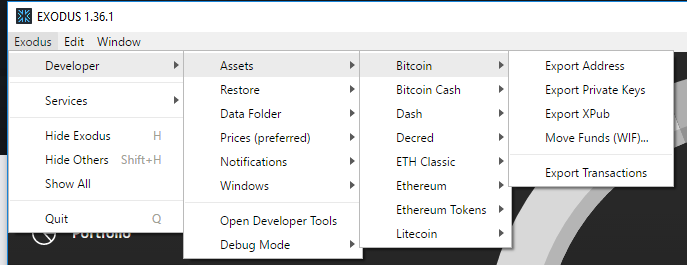

If you are serious about securing your crypto assets than it is very import you keep your private keys private and securely backed up.
In this post I'll show you how to export your private keys from a software wallet that I use called Exodus.

## What is Exodus

<a href="https://www.exodus.io/">Exodus</a> is a free software wallet that I personally reccomend for keeping your crypto assets safe.
It does not store your private keys and supports a wide array of crypto assets.
It is US based, has a nice looking UI and a track record of excellent support.

## Exporting your private keys

To export your private keys login to Exodus and bring up the developer toolbar by holding down "Ctrl + Shift + D".

Navigate to "Exodus > Developer > Assets" like the image below.

Each asset your holding has it's own private key so make sure to export each one. 
I also reccommend exporting the address for safe keeping as well.

## Move offline and cleanup

Once you've exported all your keys I reccomend transfering them to a flash drive or two and then physically securing the flash drive where no one will find it.
Make sure to delete your private keys from your computer afterwards. 

It is NOT safe leaving them hidden somewhere on your computer.
Malware has been known to scan victims computers for wallet keys so putting them on a device not connected to the web provides an important layer of protection.
