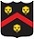

Hello, my name is Brian Ford and I am passionate about technology. I love exploring new technology and learning how to apply it in order to solve problems. I am constantly looking for new challenges. I enjoy working outside my comfort zone and continuing to learn new languages and development techniques.

I was first introduced to programming when I was 13. I learned how to write Java code in order to automate myself playing an online game. Empowered with this new realization that you can make your computer work for **YOU** by writing code. I've since set out on a journey of exploration and innovation.
 
When I'm not programming I like to get outside and explore the great city of Boston. I grew up just outside the city and am a huge Patriots, Red Sox and Celtics fan. I also enjoy snowboarding, running and biking.

>"Intelligence is the ability to avoid doing work, yet getting the work done"
>\- Linus Torvalds
>
>"Get busy living or get busy dying"
>\- Andy Dufresne (Shawshank Redemption)

## Experience

 Citrix

**Software Engineer:** C++/C# code base. Bug fixes, feature development, cloud integrations, devops. Became familair with different 

 Xamarin Inc

**DevOps Intern:** Managed and maintained build machines and continious integration pipeline. Wrote a Jenkins plugin to upload build artifacts to OneDrive.

 MFS INvestment Management

**QA Automation Intern:** Developed automated tests using headless Javascript testing platform that met acceptance criteria.

 Percussion Software

**Software Engineering Intern:** Wrote and maintained nightly automated tests. First introduction to agile and test driven development process.

 Wentworth Institute of Technology

**CS Teachers Assistant:** Crafted a basic C++/networking boot camp aimed at introducing incoming students to basic programming concepts.

 Blue Vase Marketing

**IT Department Intern:** Developed web based application in Javascript. Diagnosed PC and server issues.

 
## Skills
<i class="fa fa-code" /> **Programming languages:** Java, C++, C#, Python, Ruby, Javascript, PHP, Powershell, GO

<i class="fa fa-cubes" /> **Platforms:** Windows, Linux, MacOS

<i class="fa fa-cloud" /> **Cloud Platforms:** Amazon AWS, Microsoft Azure

 
## Education

 Graduate of Wentworth Institute of Technology with a BS in Computer Science

<i class="fa fa-pencil" /> **Favorite Classes:** Operating Systems, Software Engineering, Philosophy 