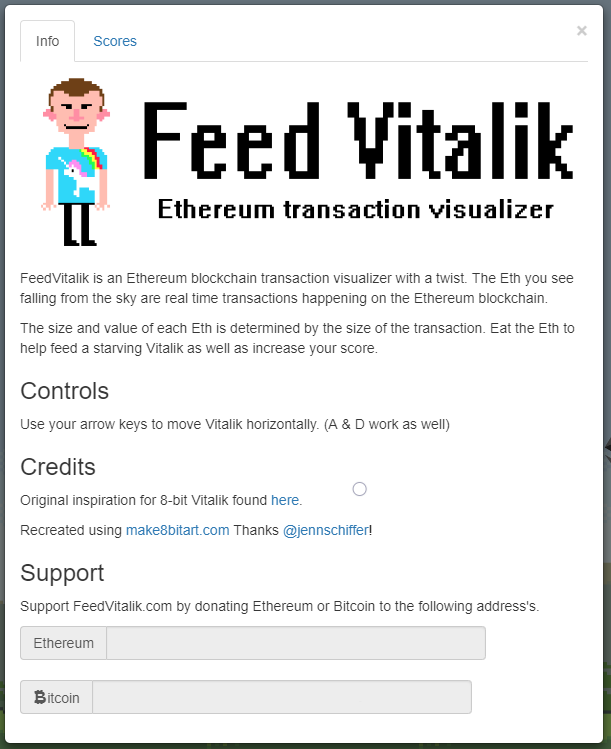
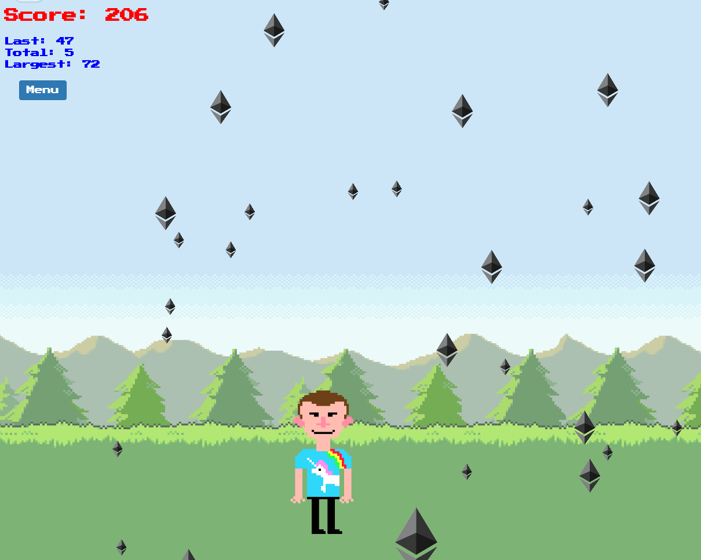

 ---
layout: page
title: Feed Vitalik
comments: true
---

After having fallen down the crypto rabbit hole one of my favorite things about decentralized public blockchains was the treasure trove of data freely avaialable ready for anyone to look at or use. 
I found myself drawn to individuals in the ecosystem like Nic Carter or Eric Wall that also shared this excitement for the data.

A common tool used to explore some of this data is a blockchain transaction visualizer.
I began looking at many transaction visualizers out there and while it was neat to see objects fly by the screen or drop from the sky.
Most of the visualizers out there are static.
There is little to no interation on behalf of the user viewing the page.
Armed with this realization an idea was sprung.

Naturally, the first thing I did when this idea struck me was buy a domain name. feedvitalik.com (not live yet!)

Then, I got to work. 

 

The result was a gamified Ethereum transaction visualizer where the goal is to get the highest score possible.
The Eth falling from the sky are near real time on-chain transactions.
The size of the Eth symbol is correlated to how much Eth is being transfered and the speed at which it falls is determined by how much gas was paid.

One of the larger decisions I had to make when starting this project was my data source.
Where was I going to pull these transactions from?
I could run my own node and use the native JSON-RPC interface.
I could use a node hosting service like DAppNode.
Or I could tie into one of many API's available from providers like Infura.

Ultimately I chose to use Infura's API just to get things working.
However, I'd love to use web3.js or host my own node eventually.

This is still an ongoing project and I'm really excited to jump back in to work on this over the next couple weeks.
Ideally I'd love to host this using IPFS and use a .eth domain name - anyone know who registered feedVitalik.eth :)

I'd love feedback positive or negative!