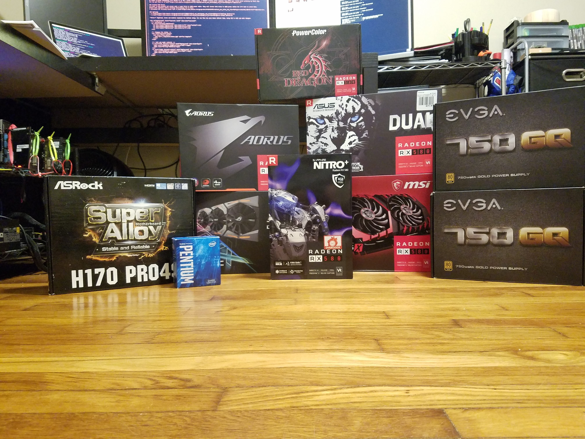
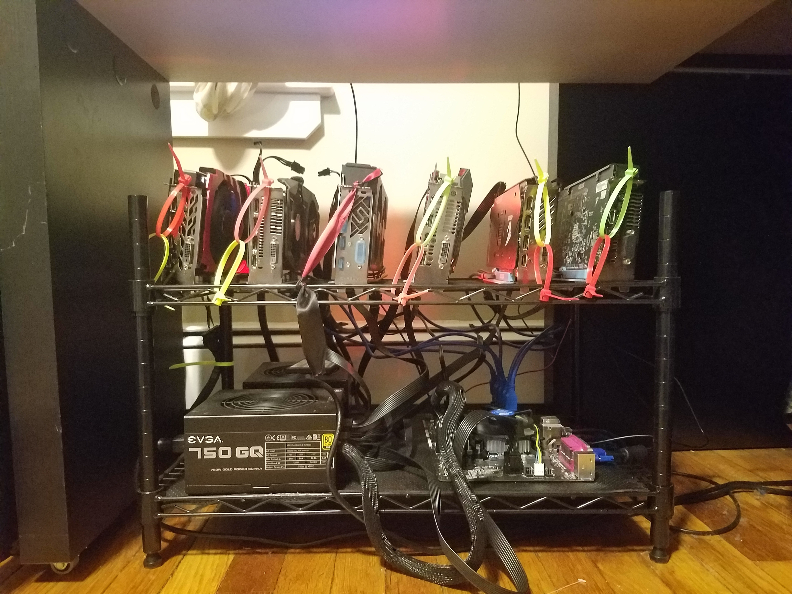
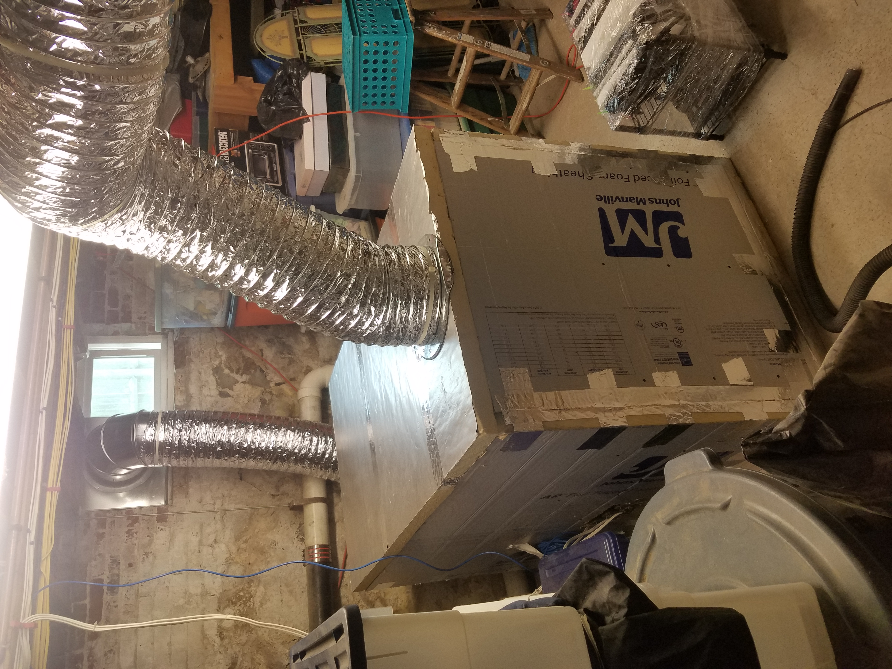

Having tought myself to code at a young age and gone to school for Computer Science I was always more interested in the software side of computing opposed the hardware side.
I wasn't a big gamer either so I never was incentivised to build my own computer or buy the latest graphics card.
That all changed in early 2017 when I discovered that graphics cards could be used for much more than playing games. 
They could be used to mine different cryptocurrencies!

This was finally my incentive to build a computer and learn about the hardware side of computing. So I bought the parts.

 

Despite having never built a computer before I wasn't all that concerned with figuring out how to build a mining rig.
I had taught myself to code I could teach myself to assemble a computer in no time, right?

As much as I'd like to say building my first mining rig was a breeze, it definitely was not.
I had so much to learn.
Here's a quick list of some of those obstacles.

1. Why won't this CPU fit in my motherboard? (1150 vs 1151 socket types)
2. How do I turn on this second power supply? My motherboard only has one 24pin connector? (Jump start power supply by shorting pins 4 & 5 with a paper clip)
3. I didn't buy a power button how do I turn this thing on? (Short the PWR_SW and PWR_BTN headers on the board with a screwdriver)
4. Cards 4 and 5 aren't being recognized, why? (Power source for PCI-E risers must be same as GPU)
5. These molex => sata connections are super hot and melting the outside cabling. Is my house going to burn down? (PCI-E to sata cables are best)
6. How do I overclock/undervolt these cards to optimize for efficiency?
7. How do I flash a custom BIOS to these GPUs so I can optomize even more?
8. WHY ARE THEY SO HOT!!

This is just a short list of the many obstacles and questions I had to overcome in order to finally build myself a stable and optimized GPU mining rig. 
The final result.

 

I had so much fun tinkering with this rig, trying to find the perfect balance between stability and performance that I quickly wanted to build another.
The only problem?
My small 2 bedroom apartment was already so hot with 1 rig nevermind two!

Rather than letting this stop me. I began solutioning. 

This is an insulated, airtight box built out of foil-faced foam sheathing roughly 75 cubic feet in size.
It has a passive intake with a filter for dust on one side and an exhaust on another side just out of view.
Attached to the exhaust side is a commercial grade exhaust blower.

This approach to cooling has withstood the test of time and keeps my hardware running at a manageable 70-72 degrees celcius. 
I quickly learned that it's more efficient to take hot air off than put cold air on.

Once I had built a couple rigs and had perfected my recipe of custom BIOS mods combined with overclocking and undervolting.
I began putting my software skills to work architecting and building a custom monitoring dashboard for my hardware. 

I had quite a few input streams to pull data from. 

1. Mining pool API
2. Mining software API 
3. CoinMarketCap API

Using these 3 sources of input I quickly put together a bare bones dashboard for myself that would tell me the following. 

1. How many active workers currently running
2. Hashrate of each individual card, rig and total
3. How much electricity I was using
4. Profitability based on the current price of ETH
5. Total uptime
6. GPU temperature

Having invested a decent chunk of change at this point it was important to me to have these type of stats and visibility.
The frontend for my dashboards was written in Javascript using Angular as a frontend framework.
I wrote an AWS Lambda function to query the api endpoints every 5 minutes and populate an Amazon RDS instance that my frontend could talk to. 

All together I'm super proud of what I've built over the last couple years.
It's been an awesome hobby and side project to learn on!

Questions? Ask me below. Beware I can talk about this stuff for hours and might bore you :)
