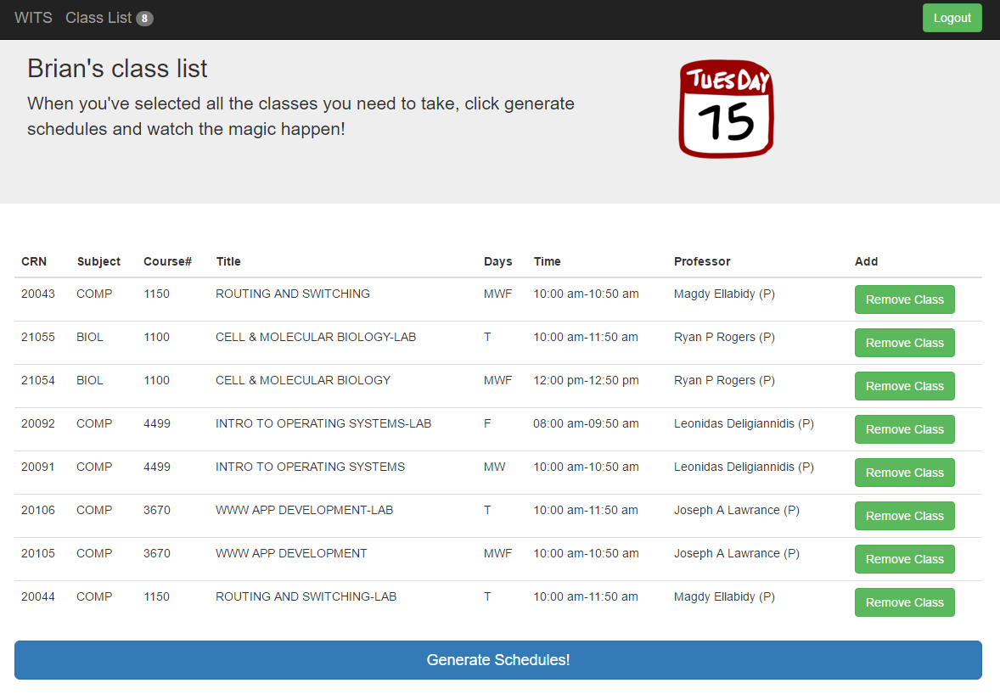

WITS (Wentworth Institute of Technology Scheduler) is a web based application that allows Wentworth students to generate class schedules. WITS gathers information about it's user's
such as when they are available to take classes, what classes they have to take and what professors they do not want to have a class with.
Based on this criteria it will generate all schedule combinations for a user.

Languages used: **Javascript, PHP, JQuery, HTML, CSS, SQL**

<input  align type="button" class="btn btn-primary" value="View on Github" onclick="location.href = 'https://github.com/bford21/WITS';">

 